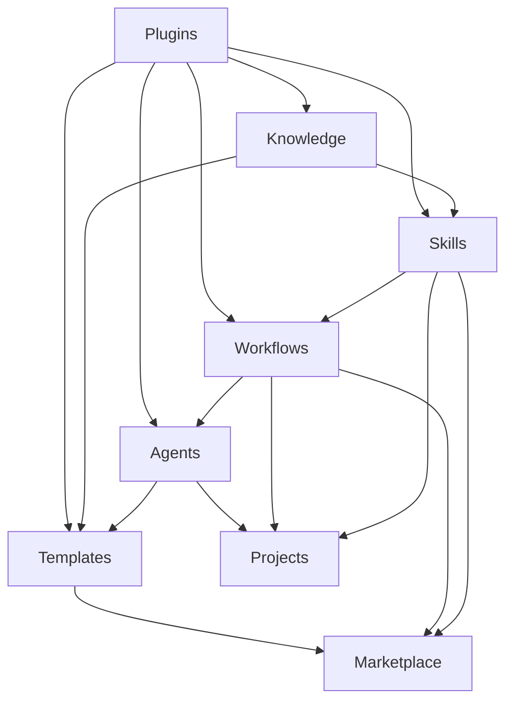

# BeU Workbench 数据架构 (优化版)

## 数据架构原则

**核心原则：**
1. **本地优先 + 云端可选** - Markdown + YAML/JSON + Git 作为基础，支持云端同步
2. **插件友好** - 数据结构支持插件扩展和第三方集成
3. **块级结构** - 借鉴 Logseq 的块级引用，支持细粒度引用
4. **能力封装** - 数据结构支持 Skill 的打包、发布和交易
5. **性能优先** - 支持增量索引、缓存和并行处理

## 数据分层架构 (重构版)

```
BeU Workbench
├── 数据层 (Data Layer)
│   ├── Knowledge (块级结构)
│   ├── Skills (可交易能力)
│   ├── Workflows (可视化编排)
│   ├── Agents (统一接口)
│   ├── Tools (插件化)
│   ├── Templates (变量化)
│   ├── Projects (能力应用)
│   └── Plugins (插件数据)
├── 索引层 (Index Layer)
│   ├── 块级索引
│   ├── 全文搜索
│   ├── 关系图谱 (Neo4j)
│   ├── 向量索引 (语义搜索)
│   └── 能力注册表
├── 服务层 (Service Layer)
│   ├── Skill Engine
│   ├── Workflow Engine
│   ├── Agent Runtime
│   ├── Plugin Manager
│   └── Market Service
├── 展示层 (Presentation Layer)
│   ├── UI 组件
│   ├── 可视化编辑器
│   └── 交互界面
└── AI 能力层 (AI Capability Layer)
    ├── 自动知识抽取
    ├── Skill 自动生成
    ├── 智能推荐
    └── 执行分析
```

## 目录结构设计 (增强版)

```
beu-workbench/
├── knowledge/              # 知识数据 (块级结构)
│   ├── articles/          # 文章
│   ├── notes/            # 笔记
│   ├── tutorials/        # 教程
│   ├── reading/          # 阅读
│   ├── inspiration/      # 灵感
│   ├── cases/            # 案例
│   ├── experience/       # 经验
│   ├── methodologies/    # 方法论
│   └── blocks/           # 块级存储 (新增)
├── skills/                # 技能数据 (可交易)
│   ├── coding/
│   │   ├── code-review/
│   │   │   ├── SKILL.md
│   │   │   ├── Capability.md (新增)
│   │   │   ├── Instructions.md
│   │   │   ├── Knowledge/
│   │   │   ├── Templates/
│   │   │   ├── Scripts/
│   │   │   ├── Examples/
│   │   │   ├── Tests/ (新增)
│   │   │   ├── Metrics/ (新增)
│   │   │   ├── Pricing/ (新增)
│   │   │   └── Version/ (新增)
│   ├── interview/
│   ├── content-writing/
│   ├── research/
│   ├── data-analysis/
│   └── product-design/
├── workflows/             # 工作流数据 (可视化)
│   ├── analysis/
│   ├── preparation/
│   ├── production/
│   ├── automation/
│   └── templates/ (新增)
├── agents/                # Agent 配置 (统一接口)
│   ├── codex/
│   ├── claude/
│   ├── mcp/
│   ├── local/
│   └── registry/ (新增)
├── tools/                 # 工具数据 (插件化)
│   ├── scripts/
│   ├── cli/
│   ├── mcp/
│   ├── api/
│   └── plugins/ (新增)
├── templates/             # 模板数据 (变量化)
│   ├── documents/
│   ├── code/
│   ├── projects/
│   ├── processes/
│   └── variables/ (新增)
├── projects/              # 项目数据 (能力应用)
│   ├── open-source/
│   ├── commercial/
│   ├── learning/
│   ├── content/
│   └── executions/ (新增)
├── plugins/               # 插件数据 (新增)
│   ├── data-sources/
│   ├── agents/
│   ├── ui/
│   ├── tools/
│   └── exporters/
├── marketplace/            # 市场数据 (新增)
│   ├── skills/
│   ├── workflows/
│   ├── templates/
│   └── plugins/
├── config/                # 配置数据
│   ├── settings/
│   ├── metadata/
│   ├── indexes/
│   └── plugins/ (新增)
└── database/              # 数据库 (新增)
    ├── local.db          # SQLite 本地数据库
    ├── graph.db          # Neo4j 图数据库
    └── vector.db         # 向量数据库
```

## 数据模型设计 (增强版)

### Knowledge 数据模型 (块级结构)

```yaml
# knowledge/articles/article-001.md
---
title: "文章标题"
slug: "article-001"
created: "2026-01-15"
updated: "2026-01-20"
tags: ["tag1", "tag2"]
category: "技术"
status: "published"
blocks:
  - id: "block-001"
    type: "heading"
    content: "标题"
  - id: "block-002"
    type: "paragraph"
    content: "段落内容"
    skill_ref: "skills/coding/code-review" (新增)
  - id: "block-003"
    type: "code"
    content: "代码块"
    execution_result: "results/execution-001.json" (新增)
related:
  - knowledge/notes/note-001.md
  - knowledge/articles/article-002.md
---

文章内容...
```

### Skill 数据模型 (可交易能力)

```yaml
# skills/coding/code-review/SKILL.md
---
name: "Code Review Skill"
slug: "code-review"
version: "1.0.0"
category: "coding"
description: "全面的代码审查技能"
author: "beu"
created: "2026-01-15"
updated: "2026-01-20"
tags: ["code-review", "quality", "security"]
pricing: (新增)
  model: "subscription"
  price: 9.99
  currency: "USD"
  period: "monthly"
capability_level: "advanced" (新增)
input_schema: (新增)
  type: "object"
  properties:
    code:
      type: "string"
      description: "待审查的代码"
    language:
      type: "string"
      description: "编程语言"
    context:
      type: "string"
      description: "代码上下文"
  required: ["code", "language"]
output_schema: (新增)
  type: "object"
  properties:
    review:
      type: "object"
      description: "审查报告"
    suggestions:
      type: "array"
      description: "改进建议"
    score:
      type: "number"
      description: "代码质量评分"
performance_metrics: (新增)
  avg_execution_time: "2.5s"
  success_rate: 0.95
  user_satisfaction: 4.5
workflow: "workflows/code-review/basic.md"
dependencies: (新增)
  - skill: "skills/analysis/text-analysis"
    version: ">=1.0.0"
  - skill: "skills/coding/security-analysis"
    version: ">=1.0.0"
market_info: (新增)
  listing_id: "marketplace/skills/code-review"
  total_sales: 150
  rating: 4.7
  reviews: 42
---

## Capability Description (新增)

### 能力概述
- 支持多种编程语言的代码审查
- 自动检测安全漏洞
- 性能优化建议
- 可维护性评估

### 适用场景
- Pull Request 审查
- 代码质量检查
- 安全审计
- 性能优化

### 技术栈
- 静态分析工具
- 安全扫描引擎
- 性能分析工具
- 代码规范检查器

## Instructions

执行代码审查的具体指令...

## Knowledge

关联的知识库资源...

## Templates

使用的模板...

## Examples

示例案例...

## Tests (新增)

测试用例和验证方法...

## Metrics (新增)

性能指标和质量标准...

## Pricing (新增)

定价策略和授权模式...

## Version (新增)

版本历史和变更记录...
```

### Workflow 数据模型 (可视化)

```yaml
# workflows/analysis/jd-analysis/workflow.md
---
name: "JD Analysis Workflow"
slug: "jd-analysis"
version: "1.0.0"
category: "analysis"
description: "职位描述分析工作流"
author: "beu"
created: "2026-01-15"
updated: "2026-01-20"
visual_config: (新增)
  layout: "directed"
  auto_layout: true
  theme: "dark"
nodes: (新增)
  - id: "node-001"
    type: "skill"
    skill: "skills/analysis/text-analysis"
    position: {x: 100, y: 100}
  - id: "node-002"
    type: "agent"
    agent: "claude"
    position: {x: 300, y: 100}
  - id: "node-003"
    type: "condition"
    condition: "score > 0.8"
    position: {x: 500, y: 100}
edges: (新增)
  - from: "node-001"
    to: "node-002"
    condition: "success"
  - from: "node-002"
    to: "node-003"
    condition: "has_output"
variables: (新增)
  - name: "jd_text"
    type: "string"
    required: true
  - name: "target_role"
    type: "string"
    required: false
market_info: (新增)
  template_id: "marketplace/workflows/jd-analysis"
  downloads: 320
  rating: 4.5
---

## Workflow Definition

详细的工作流定义...

## Execution History (新增)

执行历史和结果分析...
```

### Agent 数据模型 (统一接口)

```yaml
# agents/registry/claude.yaml (新增)
---
name: "Claude Agent"
slug: "claude"
type: "llm"
provider: "anthropic"
version: "3.5"
endpoint: "https://api.anthropic.com/v1/messages"
capabilities: (增强)
  - "text-generation"
  - "code-generation"
  - "analysis"
  - "reasoning"
  max_tokens: 8192
  context_window: 200000
authentication:
  type: "api-key"
  key_env: "ANTHROPIC_API_KEY"
rate_limit:
  requests_per_minute: 60
  tokens_per_minute: 100000
cost_model: (新增)
  input_price: 3.0
  output_price: 15.0
  currency: "USD"
  unit: "per_1m_tokens"
performance_metrics: (新增)
  avg_latency: "1.2s"
  success_rate: 0.99
  quality_score: 4.8
supported_skills: (新增)
  - "skills/analysis/*"
  - "skills/coding/*"
  - "skills/writing/*"
---

## Agent Configuration

Agent 的详细配置...

## Integration Examples (新增)

集成示例和最佳实践...
```

### Plugin 数据模型 (新增)

```yaml
# plugins/data-sources/notion/plugin.yaml
---
name: "Notion Data Source"
slug: "notion-data-source"
version: "1.0.0"
type: "data-source"
author: "beu"
description: "从 Notion 导入数据到 BeU Workbench"
capabilities:
  - "import"
  - "sync"
  - "export"
authentication:
  type: "oauth2"
  scopes: ["read", "write"]
permissions: (新增)
  - "read:knowledge"
  - "write:knowledge"
  - "network:access"
api: (新增)
  endpoints:
    - path: "/api/notion/import"
      method: "POST"
      description: "从 Notion 导入数据"
    - path: "/api/notion/sync"
      method: "POST"
      description: "同步 Notion 数据"
configuration: (新增)
  schema:
    type: "object"
    properties:
      workspace_id:
        type: "string"
        description: "Notion Workspace ID"
      sync_interval:
        type: "number"
        description: "同步间隔（分钟）"
dependencies: (新增)
  - name: "@notionhq/client"
    version: "^2.2.0"
market_info: (新增)
  listing_id: "marketplace/plugins/notion-data-source"
  downloads: 1200
  rating: 4.6
  reviews: 85
---

## Plugin Documentation

插件使用文档...

## API Reference

API 参考文档...

## Examples

使用示例...
```

### Marketplace 数据模型 (新增)

```yaml
# marketplace/skills/code-review/listing.yaml
---
listing_id: "marketplace/skills/code-review"
type: "skill"
skill_ref: "skills/coding/code-review"
seller: "beu"
pricing:
  model: "subscription"
  tiers:
    - name: "basic"
      price: 9.99
      features: ["basic review", "security check"]
    - name: "pro"
      price: 19.99
      features: ["advanced review", "performance analysis", "priority support"]
visibility: "public"
status: "active"
created: "2026-01-15"
updated: "2026-01-20"
statistics:
  total_sales: 150
  total_revenue: 1498.50
  active_subscribers: 89
  views: 2340
  conversion_rate: 0.064
reviews:
  average_rating: 4.7
  total_reviews: 42
  recent_reviews:
    - user: "user123"
      rating: 5
      comment: "非常实用的代码审查技能"
      date: "2026-01-18"
---

## Listing Description

市场列表描述...

## Support Information

支持信息...
```

## 数据关系设计 (增强版)

### 核心关系



### 块级引用关系 (新增)

1. **Knowledge Blocks → Skills**: 块可以引用 Skills
2. **Skills → Knowledge Blocks**: Skills 可以引用知识块
3. **Execution Results → Knowledge Blocks**: 执行结果可以成为知识块
4. **Workflow Nodes → Skills**: 工作流节点可以引用 Skills

### 插件数据关系 (新增)

1. **Plugins → Knowledge**: 插件可以导入/导出知识
2. **Plugins → Skills**: 插件可以扩展 Skill 功能
3. **Plugins → Agents**: 插件可以集成新的 Agent
4. **Plugins → Tools**: 插件可以添加新的工具

### 市场数据关系 (新增)

1. **Skills → Marketplace**: Skills 可以发布到市场
2. **Workflows → Marketplace**: Workflows 可以作为模板发布
3. **Plugins → Marketplace**: 插件可以在市场中分发
4. **Marketplace → Users**: 用户可以从市场购买/下载

## 数据索引策略 (增强版)

### 块级索引 (新增)
- 使用块 ID 作为索引键
- 支持块的快速查找和引用
- 增量索引更新

### 向量索引 (新增)
- 使用向量数据库进行语义搜索
- 支持知识、Skills、Workflows 的语义匹配
- 实时向量更新

### 图数据库索引 (新增)
- 使用 Neo4j 存储关系图谱
- 支持复杂的关系查询
- 图算法支持（推荐、聚类等）

### 全文搜索 (增强)
- 使用 MiniSearch 进行全文搜索
- 支持中文分词
- 支持语义搜索
- 搜索结果排序和过滤

## 数据验证 (增强版)

### Schema 验证
- 使用 Zod 进行数据验证
- 定义每个数据类型的 Schema
- 自动验证数据完整性
- 插件数据 Schema 验证

### 业务规则验证
- 关联关系验证
- 数据一致性检查
- 业务逻辑验证
- 市场数据验证

### 隐私验证
- 敏感信息检测
- 个人数据过滤
- 隐私规则扫描
- 插件权限验证

## 数据迁移策略 (增强版)

### 从原项目迁移
- 保留原数据结构
- 映射到新数据模型
- 块级结构转换
- 逐步迁移

### 从其他工具迁移 (新增)
- Obsidian 导入插件
- Notion 导入插件
- Logseq 导入插件
- 通用 Markdown 导入

### 向后兼容
- 保留旧版本支持
- 提供迁移工具
- 平滑升级
- 数据转换

### 数据同步 (新增)
- Git 同步
- 云端同步
- 多设备同步
- 插件数据同步

## 数据安全和隐私 (增强版)

### 本地优先
- 数据默认本地存储
- 云端同步可选
- 用户完全控制
- 插件数据隔离

### 隐私保护
- 敏感数据加密
- 访问权限控制
- 审计日志
- 插件权限管理

### 数据隔离
- 用户数据隔离
- 项目数据隔离
- 工作空间隔离
- 插件沙箱隔离

### 市场数据安全 (新增)
- 交易数据加密
- 支付信息安全
- 许可证管理
- DRM 保护

## 数据备份和恢复 (增强版)

### 备份策略
- Git 版本控制
- 定期快照
- 增量备份
- 云端备份可选

### 恢复机制
- 版本回滚
- 选择性恢复
- 灾难恢复
- 市场数据恢复

## 数据性能优化 (增强版)

### 索引优化
- 增量索引
- 缓存策略
- 并行处理
- 向量索引优化

### 查询优化
- 查询缓存
- 结果分页
- 延迟加载
- 图查询优化

### 存储优化
- 压缩存储
- 去重处理
- 归档策略
- 块级存储优化

### 插件性能 (新增)
- 插件缓存
- 懒加载
- 沙箱优化
- 资源限制

## 数据 API 设计 (新增)

### 核心 API

```typescript
// Knowledge API
interface KnowledgeAPI {
  getBlocks(): Promise<Block[]>;
  getBlock(id: string): Promise<Block>;
  createBlock(data: BlockData): Promise<Block>;
  updateBlock(id: string, data: Partial<BlockData>): Promise<Block>;
  deleteBlock(id: string): Promise<void>;
  searchBlocks(query: SearchQuery): Promise<Block[]>;
}

// Skill API
interface SkillAPI {
  getSkills(): Promise<Skill[]>;
  getSkill(id: string): Promise<Skill>;
  createSkill(data: SkillData): Promise<Skill>;
  updateSkill(id: string, data: Partial<SkillData>): Promise<Skill>;
  deleteSkill(id: string): Promise<void>;
  executeSkill(id: string, input: any): Promise<SkillResult>;
  publishSkill(id: string, marketData: MarketData): Promise<void>;
}

// Workflow API
interface WorkflowAPI {
  getWorkflows(): Promise<Workflow[]>;
  getWorkflow(id: string): Promise<Workflow>;
  createWorkflow(data: WorkflowData): Promise<Workflow>;
  updateWorkflow(id: string, data: Partial<WorkflowData>): Promise<Workflow>;
  deleteWorkflow(id: string): Promise<void>;
  executeWorkflow(id: string, input: any): Promise<WorkflowResult>;
}

// Plugin API
interface PluginAPI {
  getPlugins(): Promise<Plugin[]>;
  getPlugin(id: string): Promise<Plugin>;
  installPlugin(id: string): Promise<void>;
  uninstallPlugin(id: string): Promise<void>;
  enablePlugin(id: string): Promise<void>;
  disablePlugin(id: string): Promise<void>;
}

// Marketplace API
interface MarketplaceAPI {
  searchListings(query: SearchQuery): Promise<Listing[]>;
  getListing(id: string): Promise<Listing>;
  purchaseListing(id: string, paymentData: PaymentData): Promise<Purchase>;
  downloadListing(id: string): Promise<void>;
  submitReview(id: string, review: Review): Promise<void>;
}
```

### 插件 API (新增)

```typescript
// 插件开发者 API
interface PluginDeveloperAPI {
  registerDataSource(config: DataSourceConfig): void;
  registerAgent(config: AgentConfig): void;
  registerTool(config: ToolConfig): void;
  registerUIComponent(config: UIComponentConfig): void;
  
  // 访问核心功能
  knowledge: KnowledgeAPI;
  skills: SkillAPI;
  workflows: WorkflowAPI;
  
  // 事件系统
  on(event: string, handler: Function): void;
  emit(event: string, data: any): void;
}
```

这个优化后的数据架构支持插件生态、块级结构、市场交易等核心功能，为 BeU Workbench 的差异化定位提供了坚实的技术基础。